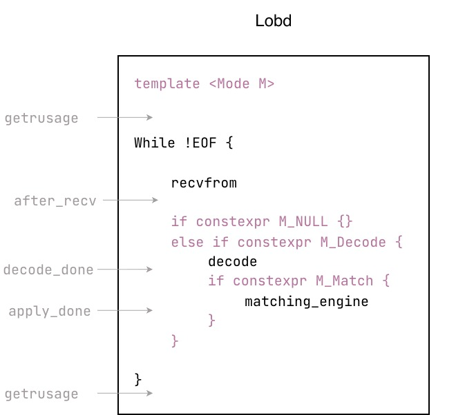

# trading-system

## What's this?

This is a performance harness to quantify and attribute C++ features regarding latency and perf counters.

Measurement Validity is the first-class citizen:
- reproducibility;
- positive/negative controls;
- single-variable and hypothesis frist experiments.
- stat validity:
  - p50/p99 latency;
  - report by center±spread (med±robust CV);
- [w2w bottleneck case study](./docs/experiments/w2w_ex2gw_bottleneck/w2w_bottleneck_saturation.md)

Three single-threaded processes in this project: _exchange_sim_, _gateway_, _lobd_ (lob daemon). Their functionalities are shown in the figure below.

Gray text with an arrow is an instrumented code.
- `before/after_* →`: timestamp by `clock_gettime(CLOCK_MONOTONIC_RAW)`
- `getrusage`: fetch voluntary and invol ctx switches.

Every experiment need to choose a data scenario and a running mode, then repeat 10 times. 

Three scenarios msgs can be generated: add_only, cross, cancel_heavy. They trigger different paths in matching engine with different frequency.

- latency experiments: `[add, cross, cancel]` × `[match]`.  To stat latencies for every interval. All timestamps will be collected for every msg.
- perf experiment: `[add, cross, cancel]` × `[null, decode, match]` To attribute perf counters to matching engine. All timestamps will be disabled to remove clock noise. Under every scenario, three perf modes need to run: Null engine, Decode, Match.

## Technique Detail for Measurement Validity

Reproducibility is guaranteed by 
- two determinism oracles:
  - Msg hash. Rolling hash for every bit of every msg generated in `ex`. Compare latency/perf difference between experiments should assert their msg hashes are identical in advance.
  - Book state hash. Different experiments should have bit-exact states (identical state hashes) in `lobd`. 
- controlled variables
  - CPU pinning. All three processes are pinned to different p-core (by `taskset -c` or in binary `sched_setaffinity`).
  - CPU governor. Set `scaling_governor` to `performance` + enable `turbo-off`. Thus, to limit CPU frequency into a narrowband.
  - `isolcpu`. Still disabled. But now I have a solid evidence (negative intervals) claims I indeed need them. 
  - pre-faulting.

## What is trading?

There are some instruments and assets, like stocks, futures and cryptos.

People buy and sell these items from each other via the exchange. All bid orders and ask orders are sent to the exchange process.

- The Best Bid is the highest price that buyers are willing to buy.
- The Best Ask is the lowest price that sellers are willing to sell.

When `Best Bid >= Best Ask`, the orders can be matched.

The exchange receives those orders from both sides in the same queue sequentially. It processes one order at a time. If `Best Bid >= Best Ask`, it will match the orders exhaustedly. All unmatched orders remain in the exchange to be maintained, called as Limit Order Book. For each item in the LOB, there is  `Best Bid < Best Ask`.

The exchange broadcasts order updates to subscribers, including those quant shops. They receive updates and reconstruct the LOB on their local, and run their algos to send orders to the exchange.
