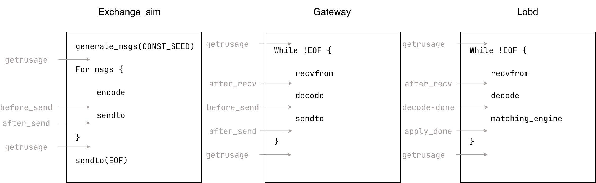
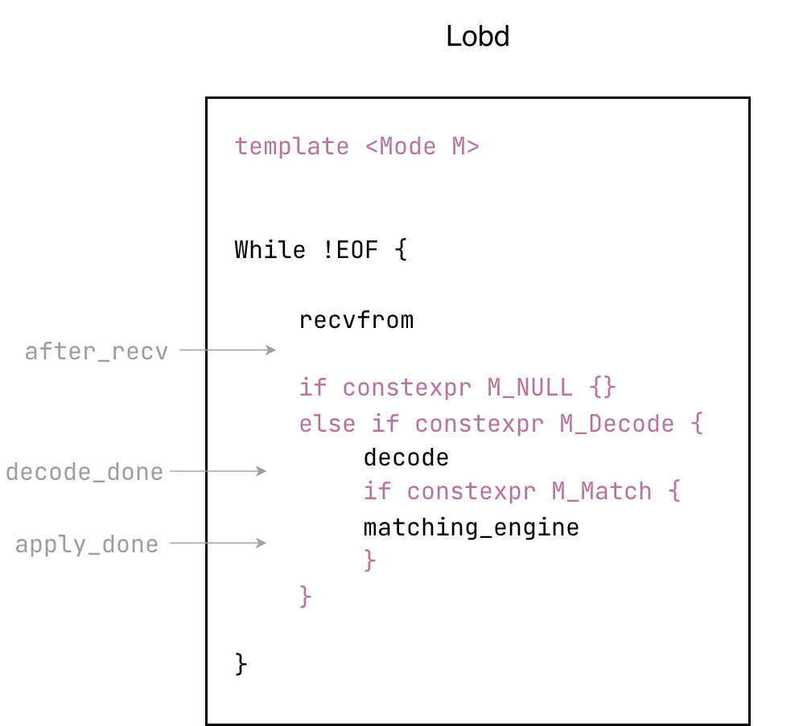

# trading-system

## What's this?

This is a C++20 measurement harness for quantifying how choices of C++ features and OS operations affect latency in a three-process trading pipeline.

This project contains three single-threaded processes: _exchange_sim_, _gateway_, and _lobd_ (LOB daemon). Their functions are shown in the figure below.



> Gray text and arrows indicate instrumented code.
> - `before/after_* →`: collects timestamps using `clock_gettime(CLOCK_MONOTONIC_RAW)`.
> - `getrusage`: fetches voluntary and involuntary context switches.

**Measurement validity** is a first-class citizen:
- reproducibility;
- positive and negative controls;
- single-variable, hypothesis-first experiments;
- statistical validity:
  - p50/p99 latency;
  - center±spread (med±MAD) report;
  - gated by `MDE=k·MAD`;
- credible baseline:
  - [w2w bottleneck](./docs/experiments/w2w_ex2gw_bottleneck/w2w_bottleneck_saturation.md)
  - [os preemption](./docs/experiments/os-preemption/negative_latencies.md)

### Workflow

Select a baseline version → state a hypothesis → change one variable → run repeated experiments.

Two kinds of experiments can be run for each variable to measure latency or perf counters:
- latency experiment: measures latency for every interval. Timestamps are collected for every message.
- perf experiment: attributes perf counters to the matching engine. Timestamp collection is disabled to remove clock noise.

Each experiment type has several repeats (10 by default). Each repeat uses a data scenario `[add, cross, cancel]` and a running mode `[null, decode, match]`. A latency experiment runs `[add, cross, cancel]` × `[match]`, using the complete `lobd`. A perf experiment runs the matrix `[add, cross, cancel]` × `[null, decode, match]`, then uses cross-mode deltas to attribute perf counters to the matching engine.



<details>
  <summary>Why use template metaprogramming</summary>

- There is only one branch and no source-code duplication.
- Plain `if-else` cannot guarantee deterministic branch prediction and leaves irrelevant code (the other two branches) in the execution path.
- Virtual functions and `std::variant` visitation introduce code duplication.

</details>

## Technical Details for Measurement Validity

Reproducibility is supported by:
- two determinism oracles:
  - Message hash. A rolling hash covers every bit of every message generated by `ex`. Before comparing latency/perf differences with the baseline, the message hashes must be identical.
  - Book-state hash. Different experiments should produce bit-exact final states (identical state hashes) in `lobd` when all processing is complete.
- controlled variables:
  - CPU pinning. All three processes are pinned to different P-cores (using `taskset -c` or `sched_setaffinity` in the binary).
  - CPU governor. Set `scaling_governor` to `performance` and enable `turbo-off` to limit CPU frequency to a narrow band.
  - `isolcpus`. It is still disabled, but solid evidence from [negative intervals](./docs/experiments/os-preemption/negative_latencies.md) shows that it is needed.
  - pre-faulting.

Negative controls: latency statistics for unmodified intervals should remain unchanged compared with the baseline.


## How to run?

```shell
# Compile
./scripts/build.sh

# Configure the experiments (repeats, latency/perf mode, and message count) in `scripts/e2e/matrix.conf`
# Run experiments
./scripts/e2e/run_matrix.sh

# Generate statistics
./scripts/stat/stat.sh

# Inspect experimental results in `./artifacts/summary/`
```


## What is trading?

There are financial instruments and assets, such as stocks, futures, and cryptocurrencies.

People buy and sell these items through an exchange. All bid and ask orders are sent to the exchange process.

- The Best Bid is the highest price at which buyers are willing to buy.
- The Best Ask is the lowest price at which sellers are willing to sell.

When `Best Bid >= Best Ask`, the orders can be matched.

The exchange receives orders from both sides in the same queue and processes them sequentially, one at a time. If `Best Bid >= Best Ask`, it matches the orders exhaustively. All unmatched orders remain at the exchange in what is called the Limit Order Book. For each instrument in the LOB, `Best Bid < Best Ask` after matching is complete.

The exchange broadcasts order updates to subscribers, including quant shops. They receive the updates, reconstruct the LOB locally, and run their algorithms to send orders to the exchange.
